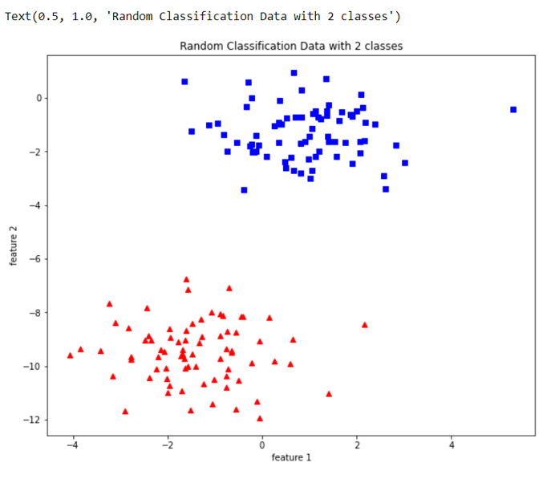

## EXP.NO: 02
## DATE  : 
# <p align='center'>  RANDOM CLASSIFICATION </p>
## AIM:
To write a python program to perform random classification.

## Equipments Required:
1. Hardware – PCs
2. Anaconda – Python 3.7 Installation / Google Colab /Jupiter Notebook

## Related Theoritical Concept:
import matplotlib.pyplot as plt-used to represent the given data set in a graphical manner.
Sklearn-used for statistical modelling and build machine learning models.
Datasets-used to introduce many small datasets and fetch large data sets.
.make_blobs-used to generate blobs of points with a gaussian distribution.

## Algorithm
### Step 1:
Import necessary libraries from packages.
### Step 2:
Assign x,y values from the given dataset by sklearn. 
### Step 3:
Plot the x and y values in the chart using mathplotlib.pyplot
### Step 4:
Label the values of x and y axis.
### Step 5:
Add title to the graph .
### Step 6:
Save the file and execute the program.


## Program:
```
/*
Program to implement random classification.
Developed by   :Sham Rathan.S
RegisterNumber : 212221230093
*/
# 01 RANDOM CLASSIFICATION- 
import matplotlib.pyplot as plt
from sklearn import datasets
X, y = datasets.make_blobs(n_samples=150,n_features=2, centers=2,cluster_std=1.05, random_state=2)               
fig = plt.figure(figsize=(10,8))
plt.plot(X[:, 0][y == 0], X[:, 1][y == 0], 'r^')
plt.plot(X[:, 0][y == 1], X[:, 1][y == 1], 'bs')
plt.xlabel("feature 1")
plt.ylabel("feature 2")
plt.title('Random Classification Data with 2 classes')  

```

## Output:



## Result:
Thus the random classifier was successfully implemented using python programming.
